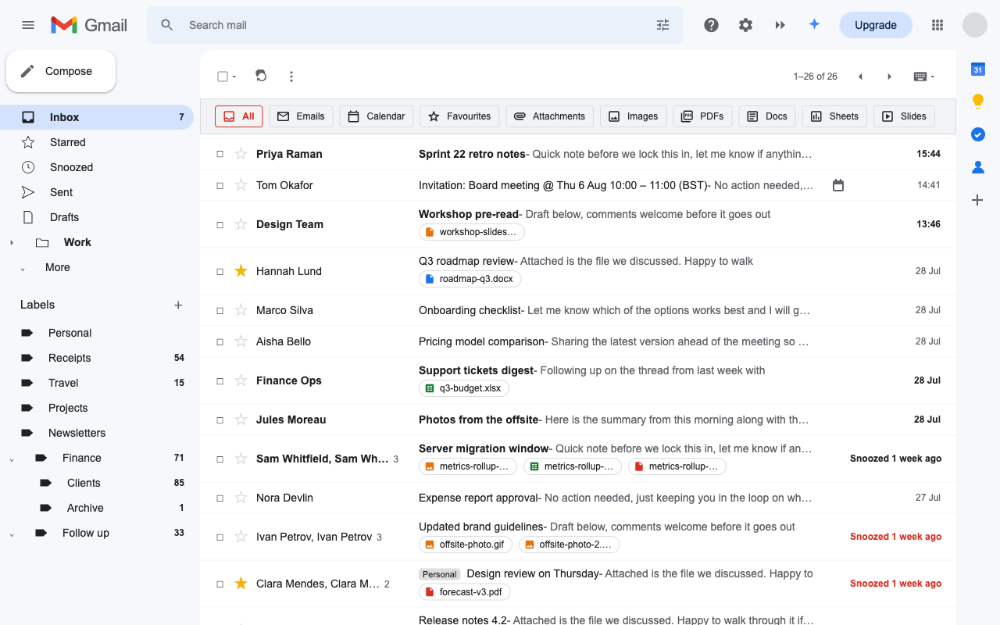
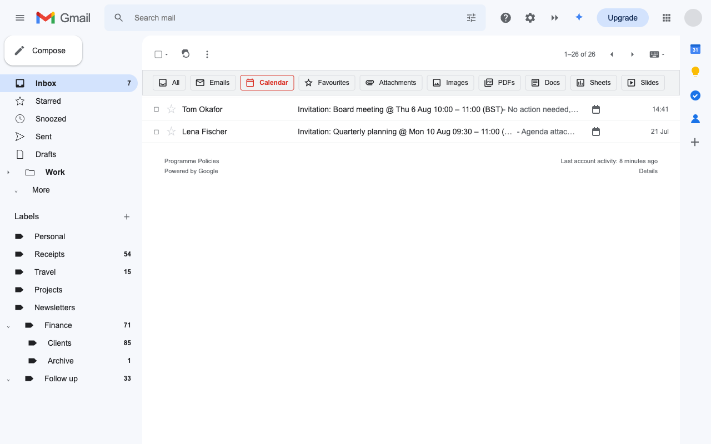
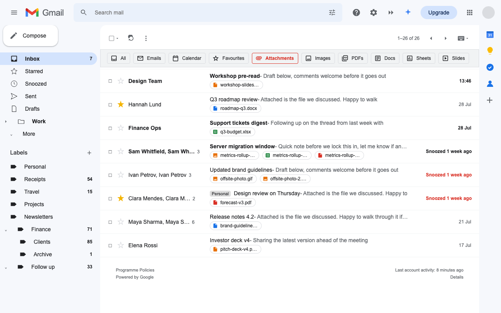
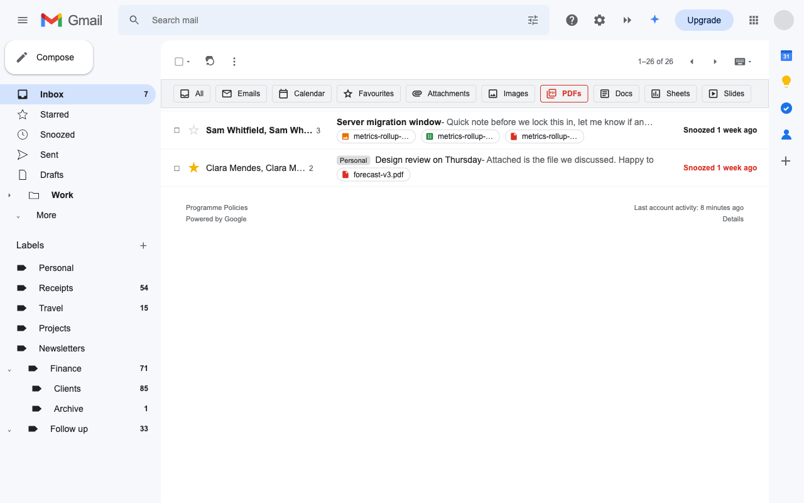
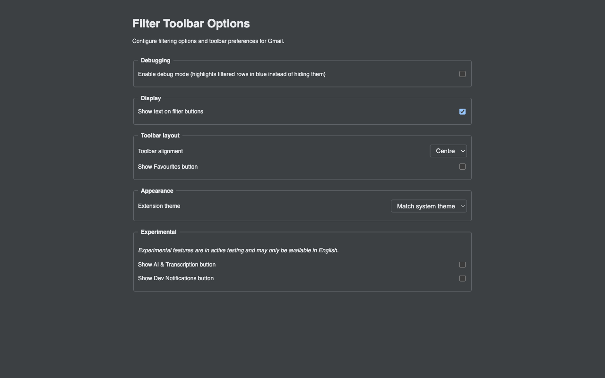
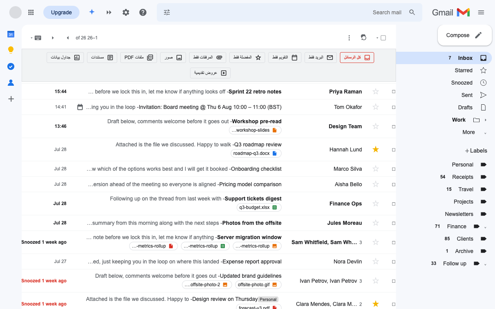

# Sift: A Filter Toolbar for Gmail

> Lightweight browser extension (Chrome & Firefox) that adds a powerful filtering toolbar to Gmail, letting you instantly view only the emails you want – calendar invites, attachments, starred messages, or regular mail – directly in your inbox or any folder.

---

## Table of Contents

1. [What It Does](#what-it-does)
2. [See It In Action](#see-it-in-action)
3. [Requirements](#requirements)
4. [Quick Start](#quick-start)
5. [Building for Production](#building-for-production)
6. [Debug Mode](#debug-mode)
7. [Keyboard & Accessibility Notes](#keyboard--accessibility-notes)
8. [Localisation](#localisation)
9. [Project Structure](#project-structure)
10. [Scripts](#scripts)
11. [Testing](#testing)
12. [Contributing](#contributing)
13. [Licence](#licence)

---

## What It Does

Transform your Gmail inbox with instant, client-side filtering. A custom toolbar appears directly below Gmail's action bar, giving you one-click access to different views of your email:

| Filter Mode                                | What You See                                                                                                                         |
| ------------------------------------------ | ------------------------------------------------------------------------------------------------------------------------------------ |
| **All Mail**                               | Everything – regular emails, calendar invites, attachments                                                                           |
| **Mail Only**                              | Just regular emails (hides calendar invites)                                                                                         |
| **Calendar Only**                          | Only meeting invites and calendar-related emails                                                                                     |
| **Attachments Only**                       | Emails with files attached (documents, images, etc.)                                                                                 |
| **Favourites Only**                        | Your starred/important messages                                                                                                      |
| **Images / PDFs / Docs / Sheets / Slides** | Emails containing the selected attachment type                                                                                       |
| **AI & Transcription** _(experimental)_    | Emails from AI services (Gemini, ChatGPT, Claude, etc.) and transcription tools (Otter.ai, Fathom, Fireflies.ai) – enable in options |
| **Dev** _(experimental)_                   | GitHub and GitLab notification emails – enable in options                                                                            |

**Works everywhere in Gmail** – inbox, sent items, labels, search results, any folder you navigate to.

### Key Features

- **Instant filtering** – No page reload, no network calls, all client-side
- **Cross-browser** – Chrome, Edge, and Firefox support
- **Persistent filters** – Your selection survives pagination and navigation
- **Customizable UI** – Toggle button text visibility, choose start/center alignment, select theme (light/dark/system)
- **Debug mode** – Visualize filtered emails with a blue tint instead of hiding them
- **Accessibility-minded** – Keyboard navigation, live announcements, forced-colour support, and
  automated accessibility checks on the options page
- **Privacy-focused** – Zero external requests, all filtering happens locally. No data is collected
  or transmitted; see [PRIVACY.md](PRIVACY.md)
- **Multi-language ready** – Localizable strings with RTL language support

---

## See It In Action

The toolbar sits directly beneath Gmail's own action bar, so it reads as part of the interface
rather than something bolted on top:



Pick a filter and the list narrows instantly – no page reload and no network request. **Calendar**
leaves only the meeting invites standing:



**Attachments** shows only messages carrying files, with Gmail's own attachment chips intact:



…and you can go straight to a single file type. **PDFs** ignores the images, spreadsheets and
documents in those same threads:



Everything is configurable from the options page – button text, alignment, theme, and the
experimental filters:



The toolbar is translated into all 25 shipped locales and mirrors for right-to-left languages:



> **Note on the screenshots:** every person, subject, message preview, attachment filename and
> label in these images is invented – nothing shown is a real person, message or file, and no real
> mailbox was captured. They are produced by running the built extension against a replica inbox
> ([`scripts/screenshots/gmail-inbox.html`](scripts/screenshots/gmail-inbox.html)) and clicking
> each filter, so the filtering itself is genuine: Sift classifies those rows with exactly the same
> code path it runs against live Gmail. The full set – one capture per filter, plus theme, layout,
> debug and language variants – lives in [`docs/screenshots/`](docs/screenshots/) and is
> regenerated with `pnpm run screenshots:capture`.

---

## Requirements

- **Google Chrome / Microsoft Edge ≥ 114** (desktop)
- **Mozilla Firefox ≥ 121** (desktop)
- **Safari ≥ 15.4** (macOS only, requires Xcode)
- **Node ≥ 20** (for build & test tooling)
- macOS, Windows, or Linux

---

## Quick Start

### For Chrome/Edge

```bash
git clone https://github.com/Kevinjohn/sift.git
cd sift

# install dev dependencies
pnpm install --frozen-lockfile

# create dist/chrome/ with manifest and assets
pnpm run build:chrome

# load unpacked extension
# 1. Open chrome://extensions (or edge://extensions)
# 2. Enable "Developer mode"
# 3. Click "Load unpacked" → select the dist/chrome/ folder
```

### For Firefox

```bash
git clone https://github.com/Kevinjohn/sift.git
cd sift

# install dev dependencies
pnpm install --frozen-lockfile

# create dist/firefox/ with Firefox manifest
pnpm run build:firefox

# load temporary extension
pnpm exec web-ext run --source-dir dist/firefox
```

Firefox will open automatically with the extension loaded.

**Or manually load**:

1. Open `about:debugging#/runtime/this-firefox`
2. Click "Load Temporary Add-on"
3. Navigate to `dist/firefox/` folder
4. Select `manifest.json`

### For Safari (macOS only)

```bash
git clone https://github.com/Kevinjohn/sift.git
cd sift

# install dev dependencies
pnpm install --frozen-lockfile

# create dist/safari/ and generate Xcode project
pnpm run safari:convert

# open in Xcode
pnpm run safari:open
```

In Xcode:

1. Build and Run (Cmd+R)
2. Safari will launch
3. Go to Safari > Preferences > Extensions
4. Enable "Sift: A Filter Toolbar for Gmail"
5. Grant permissions when prompted

**Note:** Safari extensions require an Xcode wrapper app. Settings use synced storage when
available and otherwise remain local to the device.

---

Open https://mail.google.com in a new tab – the **filter toolbar** appears just beneath Gmail's native action bar.

---

## Building for Production

### Building for Chrome/Edge

```bash
pnpm run build:chrome  # vite build → dist/chrome/
```

Upload to:

- **Chrome Web Store** (Partner Dash)
- **Edge Add-ons Store** (Partner Centre)

### Building for Firefox

```bash
pnpm run build:firefox        # Build Firefox version to dist/firefox/
pnpm run firefox:lint         # Validate Firefox extension
pnpm run firefox:package      # Create .zip for Mozilla Add-ons
```

The Firefox build includes:

- `browser_specific_settings.gecko.id` for AMO submission
- Firefox background script declaration using `background.scripts`
- Same host permissions (requires user approval in Firefox)

Upload the generated ZIP from `artifacts/firefox/` to:

- **Mozilla Add-ons (AMO)**: https://addons.mozilla.org/developers/

Validate the generated ZIPs and store metadata before each submission.

---

## Firefox-Specific Behavior

### Host Permissions

Unlike Chrome, Firefox requires users to manually grant permissions to mail.google.com:

1. Click the extension icon or shield icon in the address bar
2. Select "Always allow on mail.google.com"
3. Reload Gmail

### Temporary Installation

Extensions loaded via `about:debugging` are temporary and removed when Firefox closes. For permanent installation:

- Wait for Mozilla Add-ons (AMO) publication
- Or use Firefox Developer Edition with persistent profiles

### Background Scripts vs Service Workers

Firefox executes the background script as an event page (non-persistent background script) rather than a service worker. This is transparent to users but relevant for developers.

---

## Configuration Options

Access the extension options page via:

- **Chrome/Edge**: `chrome://extensions` → _Sift: A Filter Toolbar for Gmail_ → **Extension options**
- **Firefox**: `about:addons` → _Sift: A Filter Toolbar for Gmail_ → **Options**

### Available Settings

| Setting                                             | Description                                                                                                    |
| --------------------------------------------------- | -------------------------------------------------------------------------------------------------------------- |
| **Debug Mode**                                      | Show filtered emails with a blue tint (50% opacity) instead of hiding them – useful for verifying filter logic |
| **Show Button Text**                                | Toggle visibility of text labels on filter buttons (icons-only vs icons+text)                                  |
| **Toolbar Alignment**                               | Position the toolbar at the logical start or centre of Gmail's interface                                       |
| **Theme**                                           | Choose light, dark, or system theme preference                                                                 |
| **Show Favourites Button**                          | Enable/disable the Favourites Only filter button                                                               |
| **Show AI & Transcription Button** _(experimental)_ | Enable/disable the AI & Transcription filter button                                                            |
| **Show Dev Notifications Button** _(experimental)_  | Enable/disable the Dev Notifications filter button                                                             |

---

## Debug Mode

Enable **Debug Mode** from the extension options page to highlight rows that a filter would hide.
This lets you inspect filter classification without removing messages from the visible list.

---

## Keyboard & Accessibility Notes

- **Tab** enters the radio group at the selected filter; use **Left/Right Arrow** to move and select.
- **Escape** pressed anywhere inside the custom toolbar moves focus back to the message list (`.UI`) and announces the region to screen-reader users.
- `aria-checked` reflects radio state; status text has `aria-live="polite"` for dynamic updates.

---

## Localisation

All user-facing strings live in:

```
src/_locales/
  en/
    messages.json
  en_GB/
    messages.json
  de/
  fr/
  es_419/
  ar/
  # Chrome-supported locale identifiers only
```

Use Chrome’s i18n API in the code:

```js
chrome.i18n.getMessage('button_yes');
```

CSS relies on logical properties (`padding-inline-start`) so RTL languages mirror automatically.

---

## Project Structure

```
src/
├─ contentScript.js       # entry point: injects toolbar & coordinates filtering
├─ modules/
│  ├─ background.js       # MV3 service worker (sets install defaults)
│  ├─ constants.js        # Gmail selectors, config, storage keys, enums
│  ├─ state.js            # global state + load/save via chrome.storage
│  ├─ toolbar.js          # toolbar creation & injection
│  ├─ filter.js           # row detection & show/hide logic
│  ├─ observers.js        # MutationObservers & DOM polling
│  ├─ theme.js            # light/dark/system theme handling
│  ├─ storage.js          # cross-browser storage abstraction
│  ├─ options.js          # options page logic
│  └─ utils/debounce.js   # debounce helper
├─ _locales/              # message bundles for i18n
├─ assets/fonts/          # bundled Material Symbols icon font (subsetted)
├─ assets/icon-source.svg # editable source for the extension icon PNGs
├─ icons/                 # 16 / 32 / 48 / 128 px PNGs (for extension icon)
├─ styles.css             # toolbar styling
├─ colours.css            # light/dark/high-contrast theme variables
├─ options.html           # extension options page
├─ manifest.json          # Chrome/Edge manifest (MV3)
├─ manifest.firefox.json  # Firefox manifest (MV3)
└─ manifest.safari.json   # Safari manifest (MV3)

tests/                    # Jest unit tests + Playwright e2e suites
scripts/                  # build, release & validation scripts
dist/                     # build output (dist/chrome/, dist/firefox/, dist/safari/)
docs/                     # additional documentation
```

See [`docs/icon-maintenance.md`](docs/icon-maintenance.md) before changing the extension icon.

## Update Strategy

Gmail's user interface (UI) is dynamic and can change without notice. This extension relies on specific DOM selectors to inject its toolbar and filter email rows. If the extension stops working after a Gmail update, it's likely that one or more of these selectors have changed.

To update the selectors:

1.  **Inspect Gmail's DOM:** Open Gmail in your browser, right-click on the element that is no longer being targeted correctly (e.g., the main toolbar, an email row, or an attachment icon), and select "Inspect" or "Inspect Element".
2.  **Identify New Selectors:** In the browser's developer tools, examine the HTML structure around the element. Look for unique `id` attributes, `class` names, or `data-*` attributes that are stable and unlikely to change frequently.
3.  **Update `src/modules/constants.js`:** Open `src/modules/constants.js` and update the corresponding selector string in the `SELECTORS` object with the new, identified selector.
4.  **Test:** Rebuild the extension (`pnpm run build`) and load it unpacked in Chrome (`chrome://extensions`). Verify that the functionality is restored.
5.  **Consider Alternatives:** If a selector proves to be highly unstable, consider alternative approaches such as using `MutationObserver` to detect structural changes or relying on more general, less specific selectors combined with content analysis.

---

## How It Works

This extension is built on a few core principles: listening for the right moment to act, efficiently filtering the DOM, and persisting user choices.

**Important Note:** If a filter does not persist after navigating between email pages, see
[`docs/notes/filter-on-pagination.md`](docs/notes/filter-on-pagination.md) for the observer pattern
used with Gmail's dynamic message lists.

**Important Note:** For toolbar placement problems after Gmail navigation, see
[`docs/notes/toolbar-placement.md`](docs/notes/toolbar-placement.md).

1.  **Entry & Injection (`contentScript.js`)**:
    - The `manifest.json` file defines `contentScript.js` as the entry point, which runs after the Gmail page is idle (`"run_at": "document_idle"`).
    - `src/modules/observers.js` polls with `setTimeout` until it finds a stable Gmail toolbar
      element. Timer polling continues (at a browser-clamped rate) when a tab starts in the
      background.
    - Once the anchor element is found, the script injects the filter toolbar HTML. The CSS (`styles.css`) is designed to force Gmail's native toolbar to wrap, making space for the new UI elements.

- Toolbar icons use a locally bundled, subsetted Material Symbols Outlined font (`src/assets/fonts/`), injected via the manifest's `content_scripts` CSS — no external network requests are made.

2.  **State Management (`storage.js`, `background.js`, `options.js`)**:
    - The storage abstraction prefers `chrome.storage.sync`, falls back to `storage.local` when
      sync is unavailable, and defensively rechecks sync before migrating legacy local values.
    - `background.js` sets a default filter mode (`ALL`) when the extension is first installed.
    - `options.js` restores and serially persists the complete settings snapshot: debug mode,
      button text, optional filters, alignment, and theme.

3.  **Filtering Logic (`contentScript.js`)**:
    - When a filter button is clicked, the `currentMode` variable is updated, and the choice is saved through the active sync-or-local storage backend.
    - The `applyFilter` function is then called. It iterates through all email rows (identified by the selector `.UI tr.zA`).
    - For each row, a helper function (`isCalendarRow` or `hasAttachmentRow`) determines if it matches the filter criteria. These helpers look for clues such as a filename ending in `.ics`, Gmail's calendar icon URL, localized alternative text, and attachment classes.
    - Rows that should be hidden receive a dedicated CSS class. In debug mode, they are instead made semi-transparent for inspection.

4.  **Dynamic Updates (`contentScript.js`)**:
    - Gmail is a single-page application (SPA), so the list of emails can change without a full page reload (e.g., when paginating, searching, or receiving a new email).
    - To handle this, `observers.js` attaches `MutationObserver` instances to every active message
      list. They watch child changes and the narrow set of metadata attributes used by filters.

- When a subtree change is detected, it calls `applyFilter` again (after a short debounce) to ensure the filter is correctly applied to the new set of email rows.

---

## Scripts

| Command                   | Purpose                                                                      |
| ------------------------- | ---------------------------------------------------------------------------- |
| `pnpm run build`          | Vite build → `dist/chrome/` and `dist/firefox/`                              |
| `pnpm run build:chrome`   | Vite build → `dist/chrome/` only                                             |
| `pnpm run build:firefox`  | Vite build → `dist/firefox/` only                                            |
| `pnpm run validate:env`   | Verify the Playwright Chromium binary used by E2E                            |
| `pnpm run test:unit`      | Jest unit+integration suites (serial for CI stability)                       |
| `pnpm test`               | Jest unit-test runner                                                        |
| `pnpm run e2e`            | Playwright specs (auto-skip under WSL2; run on native Linux/macOS/Windows)   |
| `pnpm run test:e2e:ci`    | Playwright in CI mode (`list,junit` reporters)                               |
| `pnpm run audit:options`  | Lighthouse check against the built options page (`dist/chrome/options.html`) |
| `pnpm run lint`           | ESLint validation for source, tests, scripts, and build configuration        |
| `pnpm run lint:fix`       | ESLint autofix for source, tests, scripts, and build configuration           |
| `pnpm run lint:locales`   | Lints i18n message files for key/placeholder parity                          |
| `pnpm run lint:docs`      | Validates local Markdown links and heading fragments                         |
| `pnpm run verify:dist`    | Confirms tracked Chrome/Firefox bundles exactly match the build              |
| `pnpm run release:verify` | Packages and verifies existing browser builds (used after CI builds)         |
| `pnpm run format`         | Prettier auto-format (JS/CSS/HTML/JSON under `src/`)                         |

---

## Testing

See `docs/testing-playbook.md` for the full test pyramid, fixtures, and debugging recipes. Quick reference commands:

- `pnpm run validate:env` ensures Playwright Chromium is available before e2e runs.
- `pnpm run test:unit` executes the Jest unit and integration suites in-band; use `pnpm test -- --watch` for watch mode while iterating locally.
- `pnpm run e2e` drives the Playwright UI flows against an offline Gmail fixture (auto-skips under WSL2 — see note below).
- `pnpm run lint:locales` validates that every locale matches the English key set and placeholder structure.
- `pnpm run lint` and `pnpm run format` keep source files consistent before committing.
- `pnpm run audit:options` performs a Lighthouse pass against `dist/chrome/options.html` and stores reports under `artifacts/lighthouse/`.
- Playwright e2e runs attach V8 coverage for `contentScript.js` to each test’s output directory.

### WSL2 Note

Chrome MV3 extensions with service workers cannot run in Playwright under WSL2, so the e2e suite automatically skips when it detects a WSL kernel (see `playwright.config.js`). Run e2e tests on native Linux, macOS, or Windows; in WSL2, rely on the unit suite and manual browser testing.

### Manual Smoke

1. Load the unpacked extension and confirm the toolbar injects beneath Gmail’s action bar.
2. Exercise all filter modes (All Mail, Mail Only, Calendar Only, Attachments Only, Favourites Only, AI & Transcription, Dev).
3. Toggle debug mode from the options page – filtered rows should tint blue at 50 % opacity.
4. Check keyboard navigation and ensure <kbd>Esc</kbd> returns focus to Gmail’s message list.
5. Force RTL (`dir="rtl"`) in DevTools and confirm icons/text mirror correctly.

### Accessibility

- Run `pnpm run audit:options`; the command enforces the documented Lighthouse performance,
  accessibility, and best-practices budgets.
- Automated checks cover specific behaviours and surfaces; they are not a claim of full WCAG
  conformance. Complete the keyboard, forced-colour, zoom, and assistive-technology checks in the
  release checklist for each release.

---

## Contributing

Pull requests are welcome! Before raising a PR:

1. Create an issue describing the proposal.
2. `git checkout -b feature/your-branch`
3. Ensure `pnpm test && pnpm run lint` pass.
4. Update `CHANGELOG.md` under **Unreleased**.
5. Complete the [release checklist](docs/release-checklist.md) for Chrome, Firefox, and Safari.
6. Open the PR against `main`.

---

## Licence

MIT © [Kevinjohn Gallagher](https://kevinjohngallagher.com) – see [LICENSE](LICENSE) for full text.
Third-party components and their licences are recorded in
[THIRD_PARTY_NOTICES.md](THIRD_PARTY_NOTICES.md).
