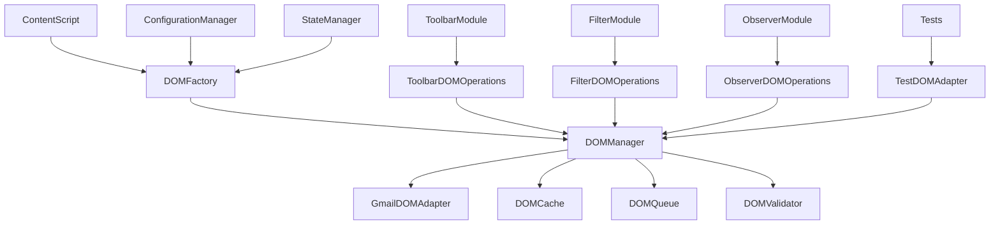

# Task 3.1: DOM Abstraction Layer Architecture

## Executive Summary

This document outlines the architecture design for extracting DOM operations into a dedicated abstraction layer, achieving clean separation between DOM manipulation and business logic. The design prioritizes testability, performance, and maintainability while maintaining the existing functionality.

## Architecture Overview

### Core Principles

1. **Separation of Concerns**: Complete isolation of DOM operations from business logic
2. **Dependency Injection**: Factory pattern for maximum testability
3. **Performance Optimization**: Batched operations and intelligent caching
4. **Error Boundaries**: Comprehensive error handling and recovery
5. **Type Safety**: JSDoc interfaces for robust API contracts

### Design Goals

- **100% Test Coverage**: All DOM operations mockable and testable
- **Performance**: <50ms filter application times through batching
- **Maintainability**: Clear interfaces and documentation
- **Extensibility**: Plugin architecture for future features
- **Robustness**: Graceful error handling and fallback mechanisms

---

## 1. DOMManager Interface Design

### Core Interface

```javascript
/**
 * @typedef {Object} DOMOperationResult
 * @property {boolean} success - Whether the operation succeeded
 * @property {*} data - Operation result data
 * @property {Error|null} error - Error if operation failed
 * @property {number} executionTime - Time taken in milliseconds
 */

/**
 * @typedef {Object} DOMQueryOptions
 * @property {Document|Element} [context=document] - Query context
 * @property {boolean} [useCache=true] - Whether to use cached results
 * @property {number} [timeout=5000] - Query timeout in ms
 * @property {string[]} [fallbackSelectors] - Fallback selectors to try
 */

/**
 * @typedef {Object} DOMUpdateOptions
 * @property {boolean} [batch=true] - Whether to batch the operation
 * @property {boolean} [validate=true] - Whether to validate inputs
 * @property {number} [priority=0] - Operation priority (higher = more urgent)
 * @property {Function} [onError] - Error callback
 */

/**
 * Core DOM Manager Interface
 */
class DOMManagerInterface {
  /**
   * Element Selection and Query Methods
   */
  select(selector, options = {}) {}
  selectAll(selector, options = {}) {}
  selectByDataAttribute(attribute, value, options = {}) {}
  getElementById(id, options = {}) {}
  
  /**
   * Element Creation and Manipulation
   */
  createElement(tagName, attributes = {}, options = {}) {}
  createElementFromTemplate(template, data = {}, options = {}) {}
  cloneElement(element, deep = true, options = {}) {}
  
  /**
   * Content Manipulation
   */
  setText(element, text, options = {}) {}
  setHTML(element, html, options = {}) {}
  getAttribute(element, attribute, options = {}) {}
  setAttribute(element, attribute, value, options = {}) {}
  removeAttribute(element, attribute, options = {}) {}
  
  /**
   * Class and Style Management
   */
  addClass(element, className, options = {}) {}
  removeClass(element, className, options = {}) {}
  toggleClass(element, className, force, options = {}) {}
  hasClass(element, className, options = {}) {}
  setStyle(element, property, value, options = {}) {}
  getStyle(element, property, options = {}) {}
  
  /**
   * DOM Tree Manipulation
   */
  appendChild(parent, child, options = {}) {}
  insertBefore(parent, newElement, referenceElement, options = {}) {}
  insertAfter(parent, newElement, referenceElement, options = {}) {}
  removeElement(element, options = {}) {}
  replaceElement(oldElement, newElement, options = {}) {}
  
  /**
   * Event Management
   */
  addEventListener(element, event, handler, options = {}) {}
  removeEventListener(element, event, handler, options = {}) {}
  delegateEvent(container, selector, event, handler, options = {}) {}
  
  /**
   * Batch Operations
   */
  batch(operations, options = {}) {}
  flush(priority = 0) {}
  
  /**
   * Performance and Monitoring
   */
  startPerformanceMonitoring(operationName) {}
  endPerformanceMonitoring(operationName) {}
  getPerformanceMetrics() {}
  
  /**
   * Error Handling and Recovery
   */
  onError(callback) {}
  retry(operation, maxAttempts = 3, delay = 100) {}
  
  /**
   * Cache Management
   */
  clearCache(selector = null) {}
  invalidateCache(selector) {}
  getCacheStats() {}
}
```

### Specialized Interfaces

```javascript
/**
 * Gmail-specific DOM operations
 */
class GmailDOMAdapter extends DOMManagerInterface {
  // Gmail-specific methods
  findEmailRows(options = {}) {}
  findToolbarContainer(options = {}) {}
  findAttachmentChips(emailRow, options = {}) {}
  waitForGmailElement(selector, timeout = 10000) {}
  
  // Gmail-specific observers
  observeEmailList(callback, options = {}) {}
  observeToolbarChanges(callback, options = {}) {}
  
  // Gmail-specific utilities
  isElementVisible(element, options = {}) {}
  scrollToElement(element, options = {}) {}
}

/**
 * Filter-specific DOM operations
 */
class FilterDOMOperations {
  applyVisibilityFilter(elements, filterFn, options = {}) {}
  batchToggleVisibility(elements, visible, options = {}) {}
  updateFilterStatus(statusElement, message, options = {}) {}
  highlightFilteredElements(elements, highlightClass, options = {}) {}
}

/**
 * Toolbar-specific DOM operations
 */
class ToolbarDOMOperations {
  createFilterButton(config, options = {}) {}
  updateButtonState(button, isActive, options = {}) {}
  createButtonGroup(buttons, options = {}) {}
  injectToolbar(container, toolbarConfig, options = {}) {}
}
```

---

## 2. Module Structure Planning

### Directory Structure

```
src/modules/dom/
├── core/
│   ├── DOMManager.js              # Core DOM manager implementation
│   ├── DOMFactory.js              # Factory for creating DOM managers
│   ├── DOMCache.js                # Intelligent caching system
│   ├── DOMQueue.js                # Operation batching and queuing
│   └── DOMValidator.js            # Input validation and sanitization
├── adapters/
│   ├── GmailDOMAdapter.js         # Gmail-specific DOM operations
│   ├── TestDOMAdapter.js          # Mock DOM for testing
│   └── BaseDOMAdapter.js          # Base adapter interface
├── operations/
│   ├── FilterDOMOperations.js     # Filter-specific operations
│   ├── ToolbarDOMOperations.js    # Toolbar-specific operations
│   └── ObserverDOMOperations.js   # Observer-specific operations
├── utils/
│   ├── DOMUtils.js                # Utility functions
│   ├── PerformanceMonitor.js      # Performance tracking
│   └── ErrorHandler.js            # Error handling utilities
├── interfaces/
│   └── DOMInterfaces.js           # TypeScript-style JSDoc interfaces
└── index.js                       # Main export file
```

### Dependency Flow



### Interface Contracts

```javascript
/**
 * Business Logic Module Interface
 * All business logic modules must implement this interface
 */
class BusinessLogicModuleInterface {
  constructor(domOperations, stateManager, configManager) {}
  
  async initialize() {}
  async cleanup() {}
  
  // Each module defines its specific methods
}

/**
 * DOM Operations Module Interface
 * All DOM operation modules must implement this interface
 */
class DOMOperationsModuleInterface {
  constructor(domManager) {}
  
  // Module-specific DOM operations
}
```

---

## 3. Implementation Strategy

### Phase 1: Core Infrastructure (Week 1)

#### 3.1.1 Create DOMManager Core
```javascript
// Priority: Critical
// Dependencies: None
// Deliverables:
// - DOMManager.js with core interface
// - DOMFactory.js with injection patterns
// - DOMValidator.js with input validation
// - Basic error handling

class DOMManager {
  constructor(adapter, cache, queue, validator) {
    this.adapter = adapter;
    this.cache = cache;
    this.queue = queue;
    this.validator = validator;
    this.performanceMonitor = new PerformanceMonitor();
    this.errorHandler = new ErrorHandler();
  }
  
  // Core implementation methods...
}
```

#### 3.1.2 Implement Caching System
```javascript
// Priority: High
// Dependencies: DOMManager
// Deliverables:
// - Intelligent query result caching
// - Cache invalidation strategies
// - Memory-efficient storage

class DOMCache {
  constructor(options = {}) {
    this.maxSize = options.maxSize || 1000;
    this.ttl = options.ttl || 30000; // 30 seconds
    this.cache = new Map();
    this.timeouts = new Map();
  }
  
  get(key) {}
  set(key, value, customTTL) {}
  invalidate(pattern) {}
  clear() {}
  getStats() {}
}
```

#### 3.1.3 Build Operation Queue
```javascript
// Priority: High
// Dependencies: DOMManager
// Deliverables:
// - Batched DOM operations
// - Priority-based execution
// - Performance optimization

class DOMQueue {
  constructor() {
    this.operations = [];
    this.isProcessing = false;
    this.batchSize = 20;
    this.maxWaitTime = 16; // One frame at 60fps
  }
  
  enqueue(operation, priority = 0) {}
  flush(priority) {}
  process() {}
}
```

### Phase 2: Gmail Adapter (Week 1-2)

#### 3.2.1 Gmail-Specific Operations
```javascript
// Priority: Critical
// Dependencies: DOMManager
// Deliverables:
// - Gmail DOM structure handling
// - Dynamic element detection
// - Robust selector strategies

class GmailDOMAdapter extends BaseDOMAdapter {
  constructor(configManager) {
    super();
    this.configManager = configManager;
    this.selectorFallbacks = new Map();
  }
  
  async findEmailRows(options = {}) {
    const selectors = [
      this.configManager.getSelector('emailRow'),
      ...this.configManager.getSelector('emailRow').fallbacks || []
    ];
    
    return await this.findWithFallbacks(selectors, options);
  }
  
  async waitForGmailElement(selector, timeout = 10000) {
    return new Promise((resolve, reject) => {
      const startTime = Date.now();
      
      const poll = () => {
        const element = document.querySelector(selector);
        if (element) {
          resolve(element);
        } else if (Date.now() - startTime > timeout) {
          reject(new Error(`Timeout waiting for ${selector}`));
        } else {
          requestAnimationFrame(poll);
        }
      };
      
      poll();
    });
  }
}
```

### Phase 3: Operation Modules (Week 2)

#### 3.3.1 Extract Filter DOM Operations
```javascript
// Priority: Critical
// Dependencies: DOMManager, GmailDOMAdapter
// Deliverables:
// - Pure filter logic separation
// - Batched visibility operations
// - Performance monitoring

class FilterDOMOperations {
  constructor(domManager) {
    this.domManager = domManager;
  }
  
  async applyVisibilityFilter(elements, filterFn, options = {}) {
    const operations = elements.map(element => ({
      type: 'setStyle',
      element,
      property: 'display',
      value: filterFn(element) ? 'none' : '',
      priority: options.priority || 0
    }));
    
    return await this.domManager.batch(operations, options);
  }
  
  async batchToggleVisibility(elements, visible, options = {}) {
    const style = visible ? '' : 'none';
    const operations = elements.map(element => ({
      type: 'setStyle',
      element,
      property: 'display',
      value: style
    }));
    
    return await this.domManager.batch(operations, options);
  }
}
```

#### 3.3.2 Extract Toolbar DOM Operations
```javascript
// Priority: Critical
// Dependencies: DOMManager, GmailDOMAdapter
// Deliverables:
// - Modular button creation
// - Event delegation setup
// - ARIA compliance

class ToolbarDOMOperations {
  constructor(domManager) {
    this.domManager = domManager;
  }
  
  async createFilterButton(config, options = {}) {
    const button = await this.domManager.createElement('button', {
      id: `filter-${config.mode}`,
      'data-mode': config.mode,
      'role': 'radio',
      'aria-label': config.label,
      'class': 'gcal-filter-button'
    }, options);
    
    // Add icon
    const icon = await this.domManager.createElement('span', {
      'class': 'material-symbols-outlined',
      'textContent': config.icon
    });
    
    await this.domManager.appendChild(button, icon);
    
    return button;
  }
  
  async injectToolbar(container, toolbarConfig, options = {}) {
    const operations = [];
    
    // Create wrapper
    operations.push({
      type: 'createElement',
      tag: 'div',
      attributes: { class: toolbarConfig.wrapperClass },
      parent: container
    });
    
    // Batch all toolbar creation operations
    return await this.domManager.batch(operations, options);
  }
}
```

### Phase 4: Migration Strategy (Week 2)

#### 3.4.1 Gradual Migration Plan

```javascript
// Step 1: Create compatibility layer
class LegacyDOMBridge {
  constructor(domManager) {
    this.domManager = domManager;
  }
  
  // Provide legacy function compatibility
  querySelector(selector) {
    return this.domManager.select(selector).data;
  }
  
  querySelectorAll(selector) {
    return this.domManager.selectAll(selector).data;
  }
}

// Step 2: Update modules one by one
// Start with toolbar.js -> filter.js -> observers.js
// Each module gets a DOM operations companion

// Step 3: Remove legacy code
// Once all modules are migrated, remove direct DOM access
```

#### 3.4.2 Migration Checklist

- [ ] **DOMManager Core**: Implement base functionality
- [ ] **GmailDOMAdapter**: Gmail-specific operations
- [ ] **Caching System**: Performance optimization
- [ ] **Operation Queue**: Batching system
- [ ] **Filter Operations**: Extract from filter.js
- [ ] **Toolbar Operations**: Extract from toolbar.js
- [ ] **Observer Operations**: Extract from observers.js
- [ ] **Test Coverage**: 100% test coverage for DOM layer
- [ ] **Performance Testing**: Verify <50ms filter times
- [ ] **Error Handling**: Comprehensive error recovery
- [ ] **Documentation**: Complete API documentation

---

## 4. Performance Optimization Patterns

### 4.1 Batching Strategy

```javascript
class DOMQueue {
  constructor() {
    this.readOps = [];
    this.writeOps = [];
    this.isScheduled = false;
  }
  
  enqueue(operation) {
    if (operation.type === 'read') {
      this.readOps.push(operation);
    } else {
      this.writeOps.push(operation);
    }
    
    this.scheduleFlush();
  }
  
  scheduleFlush() {
    if (!this.isScheduled) {
      this.isScheduled = true;
      requestAnimationFrame(() => this.flush());
    }
  }
  
  flush() {
    // Execute all reads first to avoid layout thrashing
    this.readOps.forEach(op => op.execute());
    this.readOps = [];
    
    // Then execute all writes
    this.writeOps.forEach(op => op.execute());
    this.writeOps = [];
    
    this.isScheduled = false;
  }
}
```

### 4.2 Intelligent Caching

```javascript
class DOMCache {
  constructor() {
    this.queryCache = new Map();
    this.elementCache = new WeakMap();
    this.selectorPerformance = new Map();
  }
  
  getCachedQuery(selector, context = document) {
    const key = `${selector}:${context.id || 'document'}`;
    const cached = this.queryCache.get(key);
    
    if (cached && this.isValidCache(cached)) {
      return cached.result;
    }
    
    return null;
  }
  
  cacheQuery(selector, context, result) {
    const key = `${selector}:${context.id || 'document'}`;
    this.queryCache.set(key, {
      result,
      timestamp: Date.now(),
      context: new WeakRef(context)
    });
  }
  
  isValidCache(cached) {
    // Cache expires after 30 seconds or if context is gone
    return Date.now() - cached.timestamp < 30000 && 
           cached.context.deref();
  }
}
```

### 4.3 Performance Monitoring

```javascript
class PerformanceMonitor {
  constructor() {
    this.metrics = new Map();
    this.activeOperations = new Map();
  }
  
  startOperation(name) {
    this.activeOperations.set(name, performance.now());
  }
  
  endOperation(name) {
    const startTime = this.activeOperations.get(name);
    if (startTime) {
      const duration = performance.now() - startTime;
      this.recordMetric(name, duration);
      this.activeOperations.delete(name);
    }
  }
  
  recordMetric(operation, duration) {
    if (!this.metrics.has(operation)) {
      this.metrics.set(operation, {
        count: 0,
        totalTime: 0,
        avgTime: 0,
        maxTime: 0,
        minTime: Infinity
      });
    }
    
    const metric = this.metrics.get(operation);
    metric.count++;
    metric.totalTime += duration;
    metric.avgTime = metric.totalTime / metric.count;
    metric.maxTime = Math.max(metric.maxTime, duration);
    metric.minTime = Math.min(metric.minTime, duration);
  }
  
  getReport() {
    const report = {};
    for (const [operation, metrics] of this.metrics) {
      report[operation] = { ...metrics };
    }
    return report;
  }
}
```

---

## 5. Error Handling Patterns

### 5.1 Comprehensive Error Recovery

```javascript
class DOMErrorHandler {
  constructor() {
    this.errorCallbacks = new Map();
    this.retryStrategies = new Map();
    this.fallbackStrategies = new Map();
  }
  
  async executeWithErrorHandling(operation, options = {}) {
    const maxRetries = options.maxRetries || 3;
    const retryDelay = options.retryDelay || 100;
    
    for (let attempt = 1; attempt <= maxRetries; attempt++) {
      try {
        return await operation();
      } catch (error) {
        console.warn(`DOM operation failed (attempt ${attempt}/${maxRetries}):`, error);
        
        if (attempt === maxRetries) {
          return this.handleFinalError(error, options);
        }
        
        await this.delay(retryDelay * attempt);
      }
    }
  }
  
  async handleFinalError(error, options) {
    // Try fallback strategy
    if (options.fallback) {
      try {
        return await options.fallback();
      } catch (fallbackError) {
        console.error('Fallback strategy also failed:', fallbackError);
      }
    }
    
    // Notify error callbacks
    this.notifyErrorCallbacks(error, options);
    
    // Return safe default
    return options.defaultValue || null;
  }
  
  delay(ms) {
    return new Promise(resolve => setTimeout(resolve, ms));
  }
}
```

### 5.2 Graceful Degradation

```javascript
class GracefulDegradation {
  static createSafeOperation(operation, fallback, defaultValue) {
    return async (...args) => {
      try {
        return await operation(...args);
      } catch (error) {
        console.warn('Primary operation failed, trying fallback:', error);
        
        try {
          return await fallback(...args);
        } catch (fallbackError) {
          console.error('Fallback also failed:', fallbackError);
          return defaultValue;
        }
      }
    };
  }
  
  static createRobustSelector(primarySelector, fallbackSelectors = []) {
    return (context = document) => {
      // Try primary selector
      let element = context.querySelector(primarySelector);
      if (element) return element;
      
      // Try fallback selectors
      for (const fallback of fallbackSelectors) {
        element = context.querySelector(fallback);
        if (element) {
          console.warn(`Primary selector failed, used fallback: ${fallback}`);
          return element;
        }
      }
      
      console.error(`All selectors failed: ${primarySelector}, ${fallbackSelectors.join(', ')}`);
      return null;
    };
  }
}
```

---

## 6. Testing Strategy

### 6.1 Test DOM Adapter

```javascript
class TestDOMAdapter extends BaseDOMAdapter {
  constructor() {
    super();
    this.mockDocument = new MockDocument();
    this.mockElements = new Map();
    this.operationLog = [];
  }
  
  select(selector, options = {}) {
    this.operationLog.push({ type: 'select', selector, options });
    return this.mockDocument.querySelector(selector);
  }
  
  createElement(tagName, attributes = {}) {
    const element = new MockElement(tagName);
    Object.assign(element.attributes, attributes);
    this.operationLog.push({ type: 'createElement', tagName, attributes });
    return element;
  }
  
  getOperationLog() {
    return [...this.operationLog];
  }
  
  clearLog() {
    this.operationLog = [];
  }
  
  setMockElement(selector, element) {
    this.mockElements.set(selector, element);
  }
}

class MockElement {
  constructor(tagName) {
    this.tagName = tagName;
    this.attributes = {};
    this.children = [];
    this.textContent = '';
    this.style = {};
    this.classList = new MockClassList();
  }
  
  querySelector(selector) {
    return this.children.find(child => child.matches(selector));
  }
  
  appendChild(child) {
    this.children.push(child);
  }
  
  setAttribute(name, value) {
    this.attributes[name] = value;
  }
  
  getAttribute(name) {
    return this.attributes[name];
  }
}
```

### 6.2 Unit Test Examples

```javascript
describe('DOMManager', () => {
  let domManager;
  let testAdapter;
  
  beforeEach(() => {
    testAdapter = new TestDOMAdapter();
    domManager = new DOMManager(testAdapter);
  });
  
  describe('select', () => {
    it('should use cache when available', async () => {
      // Setup
      const mockElement = new MockElement('div');
      testAdapter.setMockElement('.test', mockElement);
      
      // First call
      const result1 = await domManager.select('.test');
      
      // Second call should use cache
      const result2 = await domManager.select('.test');
      
      expect(testAdapter.getOperationLog().length).toBe(1);
      expect(result1).toBe(result2);
    });
    
    it('should handle selector fallbacks', async () => {
      const result = await domManager.select('.primary', {
        fallbackSelectors: ['.fallback1', '.fallback2']
      });
      
      const log = testAdapter.getOperationLog();
      expect(log).toContainEqual(
        expect.objectContaining({ type: 'select', selector: '.primary' })
      );
    });
  });
  
  describe('batch operations', () => {
    it('should execute operations in correct order', async () => {
      const operations = [
        { type: 'createElement', tag: 'div' },
        { type: 'setAttribute', attribute: 'class', value: 'test' },
        { type: 'appendChild', parent: '.container' }
      ];
      
      await domManager.batch(operations);
      
      const log = testAdapter.getOperationLog();
      expect(log).toHaveLength(3);
      expect(log[0].type).toBe('createElement');
      expect(log[1].type).toBe('setAttribute');
      expect(log[2].type).toBe('appendChild');
    });
  });
});
```

---

## 7. Acceptance Criteria

### 7.1 Functional Requirements

- [ ] **Complete DOM Abstraction**: No direct DOM operations in business logic modules
- [ ] **Performance**: Filter operations complete in <50ms
- [ ] **Error Handling**: Graceful degradation for all DOM operations
- [ ] **Caching**: Intelligent query result caching with automatic invalidation
- [ ] **Batching**: Efficient batching of DOM operations to prevent layout thrashing
- [ ] **Test Coverage**: 100% test coverage for DOM abstraction layer
- [ ] **API Consistency**: Consistent interface across all DOM operations
- [ ] **Memory Management**: No memory leaks from DOM references

### 7.2 Technical Requirements

- [ ] **Dependency Injection**: Clean injection of DOM dependencies
- [ ] **Interface Compliance**: All modules implement defined interfaces
- [ ] **Error Recovery**: Automatic retry with exponential backoff
- [ ] **Performance Monitoring**: Built-in performance tracking and reporting
- [ ] **Validation**: Input validation for all DOM operations
- [ ] **Documentation**: Complete JSDoc documentation for all APIs

### 7.3 Integration Requirements

- [ ] **ConfigurationManager**: Seamless integration with existing configuration system
- [ ] **StateManager**: Proper state management integration
- [ ] **Existing Modules**: Backward compatibility during migration
- [ ] **Gmail Compatibility**: Robust handling of Gmail DOM changes
- [ ] **Browser Support**: Cross-browser compatibility testing

---

## 8. Migration Timeline

### Week 1
- **Day 1-2**: Implement DOMManager core and factory
- **Day 3-4**: Build caching and queuing systems
- **Day 5**: Create Gmail DOM adapter and basic operations

### Week 2
- **Day 1-2**: Extract filter DOM operations and integrate
- **Day 3-4**: Extract toolbar DOM operations and integrate
- **Day 5**: Extract observer DOM operations and finalize

### Testing & Validation
- **Continuous**: Unit tests for each component as built
- **Week 2 End**: Integration testing and performance validation
- **Final**: Complete test coverage verification

---

## 9. Risk Mitigation

### High-Risk Areas

1. **Gmail DOM Changes**: Mitigation through robust fallback selectors
2. **Performance Regression**: Continuous performance monitoring and benchmarking
3. **Migration Complexity**: Gradual migration with compatibility layers

### Monitoring Strategy

- Performance metrics tracking
- Error rate monitoring
- Cache hit rate optimization
- Memory usage profiling

---

## 10. Future Extensibility

### Plugin Architecture

The DOM abstraction layer is designed to support future plugins:

```javascript
class DOMPlugin {
  constructor(domManager) {
    this.domManager = domManager;
  }
  
  register() {
    // Plugin registration logic
  }
  
  unregister() {
    // Plugin cleanup logic
  }
}
```

### Adapter Pattern

New Gmail versions or other email providers can be supported through new adapters:

```javascript
class OutlookDOMAdapter extends BaseDOMAdapter {
  // Outlook-specific implementations
}
```

---

This architecture provides a robust foundation for Task 3.1, ensuring clean separation of concerns, maximum testability, and optimal performance while maintaining extensibility for future enhancements.